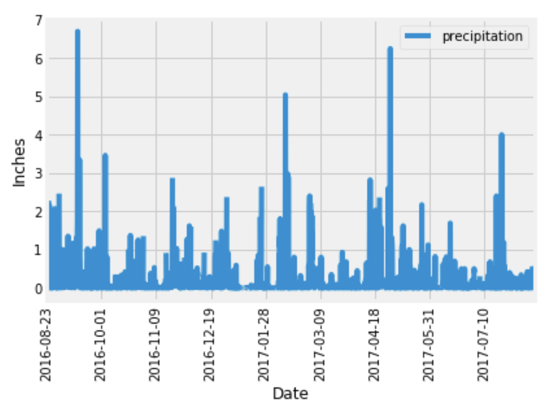
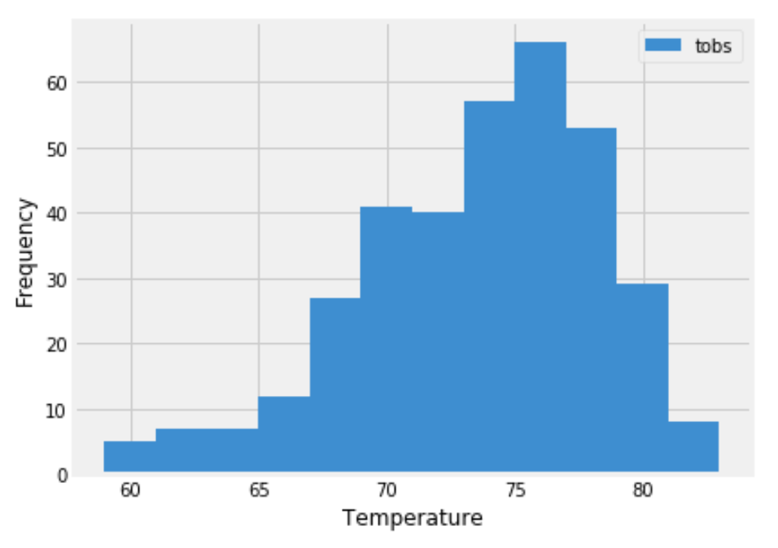

# sqlalchemy-challenge

## Before You Begin

1. Create a new repository for this project called sqlalchemy-challenge.
2. Clone the new repository to your computer.
3. Inside your local Git repository, create a directory for this Challenge. Use a folder name that corresponds to the Challenge, such as SurfsUp.
4. Add your Jupyter notebook and app.py to this folder. They’ll contain the main scripts to run for analysis. Also add the Resources folder, which contains the data files you will be using for this challenge.
5. Push the changes to GitHub or GitLab.

## Instructions

Congratulations! You've decided to treat yourself to a long holiday vacation in Honolulu, Hawaii. To help with your trip planning, you decide to do a climate analysis about the area.

## Part 1: Analyze and Explore the Climate Data

Use Python and SQLAlchemy to do a basic climate analysis and data exploration of your climate database. Use SQLAlchemy ORM queries, Pandas, and Matplotlib.

1. Use the SQLAlchemy create_engine() function to connect to your SQLite database.
2. Use the SQLAlchemy automap_base() function to reflect your tables into classes, and then save references to the classes named station and measurement.
3. Link Python to the database by creating a SQLAlchemy session.

## IMPORTANT

Remember to close your session at the end of your notebook.

4. Perform a precipitation analysis and then a station analysis by completing the steps in the following two subsections.

## Precipitation Analysis

1. Find the most recent date in the dataset.
2. Using that date, get the previous 12 months of precipitation data by querying the previous 12 months of data.
3. Select only the "date" and "prcp" values.
4. Load the query results into a Pandas DataFrame. Explicitly set the column names.
5. Sort the DataFrame values by "date".
6. Plot the results by using the DataFrame plot method, as the following image shows:

7. Use Pandas to print the summary statistics for the precipitation data.

## Station Analysis

1. Design a query to calculate the total number of stations in the dataset.

2. Design a query to find the most-active stations (that is, the stations that have the most rows). To do so, complete the following steps:

    * List the stations and observation counts in descending order.
    * Answer the following question: which station id has the greatest number of observations?

3. Design a query that calculates the lowest, highest, and average temperatures that filters on the most-active station id found in the previous query.
4. Design a query to get the previous 12 months of temperature observation (TOBS) data. To do so, complete the following steps:

    * Filter by the station that has the greatest number of observations.
    * Query the previous 12 months of TOBS data for that station.
    * Plot the results as a histogram with bins=12, as the following image shows:

5. Close your session.

## Part 2: Design Your Climate App

Design a Flask API based on the queries that you just developed. To do so, use Flask to create your routes as follows:
